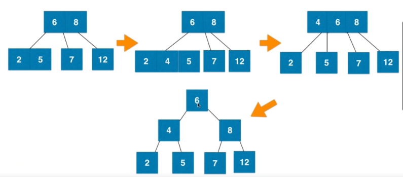
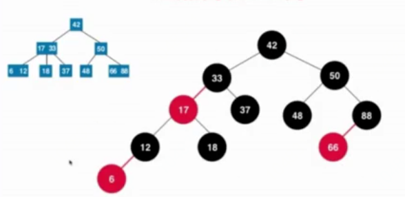
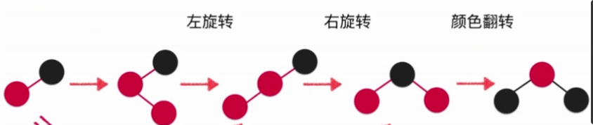

# 红黑树
*   每个节点非黑即红
*   根节点黑色
*   每一个叶子节点(最后为空节点)是黑色的
*   红色节点的孩子节点一定是黑色的。
*   从任意一个节点向下到叶子节点，经过的黑色节点数量是相同的。

## 2-3树(等价于红黑树)
*   2-3树添加节点永远不会添加到空的子节点。(与最后找到元素融合)

### 2-3树插入示例


### 红黑树与2-3树等价示例
  
(红色点和边等价于和父节点在2-3树中同级)

红黑树不是平衡二叉树，但其黑色节点决定平衡。  
红黑树最大高度为2log n，时间复杂度为O(log n)  
(红黑树最大高度大于AVL树，查效率低于AVL,但添加、删除效率高于AVL树)

## 红黑树

### node节点定义
```java
private static final boolean RED=true;
private static final boolean BLACK=false;

private class Node{
    public K key;
    public V value;
    public Node left, right;
    public boolean color;

    public Node(K key, V value) {
        this.key = key;
        this.value = value;
        left = null;
        right = null;
        color = RED;
    }
}

private Node root;
private int size;
```

### 添加新元素


```java
// 向以node为根的红黑树插入元素(key， value)
// 返回插入新节点后红黑树的根
private Node add(Node node, K key, V value) {
    if (node == null) {
        size ++;
        return new Node(key, value); //默认插入红色节点
    }

    if (key.compareTo(node.key) < 0)
        node.left = add(node.left, key, value);
    else if (key.compareTo(node.key) > 0)
        node.right = add(node.right, key, value);
    else
        node.value = value;

    // 红黑树性质维护
    //是否需要左旋转
    if (isRed(node.right) && !isRed(node.left))
        node = leftRotate(node);
    // 是否需要右旋转
    if(isRed(node.left) && isRed(node.left.left))
        node = rightRoutate(node);
    // 是否需要翻转
    if(isRed(node.left) && isRed(node.right))
        flipColors(node);

    return node;
}
```

## 树性能分析简单说明
对于完全随机数据，普通二分搜索树很好用。  
缺点：极端退化为链表。  
对于查询较多使用情况，AVL树很好用。
红黑树牺牲平衡性（2log n高度），查效率低于AVL,但添加、删除效率高于AVL树。统计综合性能更优。


